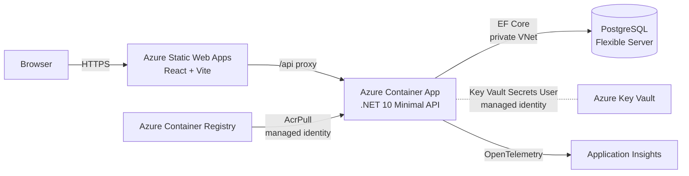

# Dostar

[](https://github.com/piers-sinclair/Dostar/actions/workflows/ci.yml)
[](https://codespaces.new/piers-sinclair/Dostar)

Skip weeks of boilerplate. Dostar gives you a production-ready fullstack app — .NET 10 modular monolith + React/Vite — with exceptional developer experience, complete DevSecOps, and automated CI/CD that deploys to production in under 30 minutes.

> **Disclaimer:** Dostar is provided as-is under the [MIT license](LICENSE). It is a starting point, not a fully hardened production system — you are responsible for security review and hardening before deploying to production.

## Goals

- **Exceptional developer experience** — devcontainer, one-click F5 full-stack launch, hot reload, pre-commit hooks, generated API client (orval), and Claude Code skills for scaffolding, migrations, and testing.
- **Complete DevSecOps** — passwordless OIDC auth to Azure, Key Vault secrets management, Trivy + OpenGrep scanning in every PR, OpenTelemetry wired to Application Insights, and P1 production alerts deployed automatically.
- **Production in under 30 minutes** — GitHub Actions pipelines build, test, scan, and auto-deploy to dev on every merge; a Release PR promotes to prod with one click.

## Architecture



See [docs/architecture.md](docs/architecture.md) for the full infrastructure topology, CI/CD pipeline, and security decisions.

## Stack

| Layer | Technology |
|-------|-----------|
| Backend | .NET 10 Minimal APIs, modular monolith |
| Frontend | React 19 + Vite + TypeScript |
| Database | PostgreSQL via EF Core (Azure Flexible Server in prod) |
| IaC | Bicep |
| Compute | Azure Container App (backend) + Azure Static Web Apps (frontend) |
| Package manager | **pnpm** — never npm or yarn |
| Tests | xUnit + Shouldly + NSubstitute / Testcontainers / Vitest / Playwright |

## Quick start

### 1. Create your project

Install the CLI once, then create a renamed copy of the template:

```bash
dotnet tool install -g Dostar.Cli  
dostar new-project MyStartup --owner xxx-yyy --author "xxx yyy"
```

`dostar new-project` clones the repo and replaces every `Dostar`/`dostar` token (namespaces, project names, solution name, Bicep parameters, config files) with your project name in one step.

### 2. Start the dev environment

The fastest path is the devcontainer — it installs all tooling, starts the database, and has one-click launch built in.

**First time:**

1. Open the project folder in VS Code and choose **Reopen in Container** when prompted (or `Ctrl+Shift+P` → `Dev Containers: Reopen in Container`). The devcontainer starts PostgreSQL automatically and installs pre-commit hooks.
2. Open the **Run and Debug** panel (`Ctrl+Shift+D`), select **`Dostar (API + Frontend)`** from the configuration dropdown at the top, then press **F5**. Migrations run automatically, then both services start.

**Every subsequent session:**

Press **F5** — VS Code remembers the selected configuration.

| Service | URL |
|---------|-----|
| Frontend | http://localhost:5173 |
| Backend health | http://localhost:5000/healthz/live |
| API docs (Scalar) | http://localhost:5000/scalar/v1 |

### 3. Explore then remove the Todos example

The **Todos module** (`backend/Modules/Todos/`) is a complete, working example of the module pattern — it demonstrates how Contracts, Implementation, unit tests, and integration tests fit together. Read through it to understand the pattern, then remove it before you start building your own features:

```bash
dostar remove-module Todos   # removes all 4 projects, cleans up Program.cs and the solution
dotnet build                 # verify everything still compiles
```

See [docs/module-pattern.md](docs/module-pattern.md) for the full guide on building your own modules.

### 4. Create your GitHub repository

```bash
gh repo create MyStartup --private --source=. --push
```

This creates a private GitHub repo, sets it as the `origin` remote, and pushes your initial commit. CI runs automatically on the first push — check the **Actions** tab to confirm it goes green.

### 5. Deploy to production

The template deploys to Azure Container Apps (backend), Azure Static Web Apps (frontend), and Azure PostgreSQL (database). CI/CD is fully automated via GitHub Actions.

**Prerequisites:** Azure CLI and GitHub CLI installed and authenticated (`az login` / `gh auth login`), with Azure Subscription Owner and GitHub repo admin access.

1. **Export variables** (run once per terminal session):

   ```bash
   export SUBSCRIPTION_ID="<your-azure-subscription-id>"
   ```
   ```bash
   export REPO="your-org/your-repo"
   ```
   ```bash
   export APP_NAME="your-app-name"
   ```

2. **Create an Azure identity** for GitHub Actions:
   ```bash
   APP_ID=$(az ad app create --display-name "$APP_NAME" --query appId -o tsv)
   az ad sp create --id "$APP_ID"
   az role assignment create --assignee "$APP_ID" --role Contributor --scope "/subscriptions/$SUBSCRIPTION_ID"
   az role assignment create --assignee "$APP_ID" --role "User Access Administrator" --scope "/subscriptions/$SUBSCRIPTION_ID"
   ```

3. **Create OIDC federation** (passwordless auth from GitHub Actions to Azure):
   ```bash
    cat > fc-main.json <<EOF
    {
      "name": "github-main",
      "issuer": "https://token.actions.githubusercontent.com",
      "subject": "repo:${REPO}:ref:refs/heads/main",
      "audiences": ["api://AzureADTokenExchange"]
    }
    EOF
    
    az ad app federated-credential create --id "$APP_ID" --parameters @fc-main.json
    
    rm -f fc-main.json
    
    cat > fc-pr.json <<EOF
    {
      "name": "github-pr",
      "issuer": "https://token.actions.githubusercontent.com",
      "subject": "repo:${REPO}:pull_request",
      "audiences": ["api://AzureADTokenExchange"]
    }
    EOF
    
    az ad app federated-credential create --id "$APP_ID" --parameters @fc-pr.json
    
    rm -f fc-pr.json
    
    cat > fc-dev.json <<EOF
    {
      "name": "github-environment-dev",
      "issuer": "https://token.actions.githubusercontent.com",
      "subject": "repo:${REPO}:environment:dev",
      "audiences": ["api://AzureADTokenExchange"]
    }
    EOF
    
    az ad app federated-credential create --id "$APP_ID" --parameters @fc-dev.json
    
    rm -f fc-dev.json
    
    cat > fc-prod.json <<EOF
    {
      "name": "github-environment-prod",
      "issuer": "https://token.actions.githubusercontent.com",
      "subject": "repo:${REPO}:environment:prod",
      "audiences": ["api://AzureADTokenExchange"]
    }
    EOF
    
    az ad app federated-credential create --id "$APP_ID" --parameters @fc-prod.json
    
    rm -f fc-prod.json
   ```

4. **Add GitHub secrets**:
   ```bash
   gh secret set AZURE_CLIENT_ID       --body "$APP_ID"
   gh secret set AZURE_TENANT_ID       --body "$(az account show --query tenantId -o tsv)"
   gh secret set AZURE_SUBSCRIPTION_ID --body "$(az account show --query id -o tsv)"
   gh secret set AZURE_POSTGRES_ADMIN_PASSWORD --body "$(openssl rand -base64 32 | tr -d '/+=')"
   gh secret set AZURE_POSTGRES_ADMIN_USERNAME --body "myadminuser"
   gh secret set ALERT_EMAIL_ADDRESS   --body "you@example.com"
   ```

5. **Allow GitHub Actions to create PRs**: GitHub repo → **Settings → Actions → General** → check **"Allow GitHub Actions to create and approve pull requests"**.

6. **Spin up**: GitHub Actions → [**Infra — spin up**](.github/workflows/infra-spinup.yml) → **Run workflow** (select `dev`). This single workflow provisions all Azure resources, bootstraps RBAC, and deploys the backend and frontend in sequence (~15 min). URLs are printed in the workflow summary when complete.

---

**Dev deploys continuously** — every merge to `main` triggers build, test, and deploy to the dev environment automatically.

**Prod deploys on demand** — the release pipeline opens a Release PR when ready; merging it promotes to prod with one click. To deploy to prod manually: Actions → **CD — release to prod** → **Run workflow**.

See [docs/deploy-setup.md](docs/deploy-setup.md) for verification steps, environment lifecycle management, and the security checklist.

### Tearing down

To remove an environment (e.g. to pause billing or decommission the app): GitHub Actions → [**Infra — tear down**](.github/workflows/infra-teardown.yml) → **Run workflow**, select the environment, and type `teardown` to confirm. The workflow deletes the resource group, which cascades to all resources inside it (Container App, PostgreSQL, Key Vault, Application Insights).

GitHub secrets and the repo are unaffected. Re-running **Infra — spin up** recreates everything from scratch.

## VS Code tasks

Tasks run via `Ctrl+Shift+P` → **Tasks: Run Task**, or directly in the terminal (see the Terminal equivalent column). Each background task opens its own tab in the Terminal panel so you can watch its output.

| Task | What it does | Terminal equivalent |
|------|-------------|---------------------|
| `run: migrate` | Runs `tools/run-migrations.sh`, which auto-discovers every module with a `Migrations/` directory and applies any pending EF Core migrations. Fast when nothing is pending. | `bash tools/run-migrations.sh` |
| `run: backend` | Applies migrations (via `run: migrate`) then starts the .NET API on `http://localhost:5000` without a debugger. | `bash tools/run-migrations.sh && dotnet run --project backend/<ProjectName>.Api --launch-profile http` |
| `run: frontend` | Starts the Vite dev server on `http://localhost:5173` with hot-module replacement. | `cd frontend && pnpm dev` |
| `run: dev` | Runs `run: backend` (which includes migrations) and `run: frontend` in parallel — full stack without a debugger. | Run `run: backend` and `run: frontend` terminal commands in two separate terminals. |
| `build: solution` | Builds the entire .NET solution. This is the default build task (`Ctrl+Shift+B`). | `dotnet build` |
| `build: <ProjectName>.Api` | Builds only the API project. Used internally by `launch: prepare`. | `dotnet build backend/<ProjectName>.Api/<ProjectName>.Api.csproj` |

## Regenerating API types

The OpenAPI spec (`backend/Dostar.Api.json`) and the frontend API client (`frontend/src/shared/api/generated/index.ts`) are committed to the repo. After any backend API change — new endpoint, renamed field, changed request or response shape — regenerate both before pushing:

```bash
dotnet build backend/Dostar.Api/Dostar.Api.csproj -c Release   # regenerates backend/Dostar.Api.json
cd frontend && pnpm generate:api                                # regenerates frontend/src/shared/api/generated/index.ts
```

Commit both files together with your backend change. CI validates that the committed artefacts match the source and will fail if they are out of sync.

## Frontend API hooks

Hooks follow a two-tier pattern.

All feature hooks live in `features/<name>/hooks/` and pull three things from `@/shared/api/generated`:

- **Types** — `CreateTodoRequest`, `TodoDto`, etc.
- **URL helpers** — `getGetTodosUrl()`, `getCreateTodoUrl()`, etc. (auto-update when the spec changes)
- **Query key helpers** — `getGetTodosQueryKey()` (for `queryKey` and cache invalidation)

The generated query/mutation hooks (`useGetTodos`, `useCreateTodo`, etc.) can't be used directly — they expect the custom mutator to return a `{ data, status, headers }` envelope, but `apiClient` returns the plain JSON body. Use `apiClient` for all HTTP calls with the correct payload type:

```typescript
import { getGetTodosUrl, getGetTodosQueryKey, getCreateTodoUrl } from '@/shared/api/generated';
import type { CreateTodoRequest, TodoDto } from '@/shared/api/generated';
import { apiClient } from '@/shared/api/client';

export function useTodos() {
    return useQuery({
        queryKey: getGetTodosQueryKey(),
        queryFn: () => apiClient<TodoDto[]>(getGetTodosUrl()),
    });
}

export function useCreateTodo() {
    const client = useQueryClient();
    return useMutation({
        mutationFn: (req: CreateTodoRequest) =>
            apiClient<TodoDto>(getCreateTodoUrl(), { method: 'POST', data: req }),
        onSuccess: () => client.invalidateQueries({ queryKey: getGetTodosQueryKey() }),
    });
}
```

Add `onMutate`/`onError`/`onSettled` only when you need optimistic updates; `onSuccess: invalidate` is sufficient for most mutations. `features/todos/hooks/useTodos.ts` is the reference implementation.

The `hooks/` folder is not scaffolded by `dostar add-feature` — create it manually when you write your first hook for a feature.

## F5 launch configurations

Configurations are in `.vscode/launch.json` and selected from the **Run and Debug** panel (`Ctrl+Shift+D`). Both run migrations before starting — no separate migration step needed.

| Configuration | What it does |
|---------------|-------------|
| `<ProjectName>.Api (http)` | Runs migrations, builds, then launches the backend with the .NET debugger attached. Opens Scalar (`/scalar/v1`) in the browser once the API is ready. Use this when you only need to debug the backend. |
| `<ProjectName> (API + Frontend)` | Starts the Vite frontend, then runs migrations, builds, and launches the backend with the debugger. **This is the recommended default for full-stack work.** |

To set `<ProjectName> (API + Frontend)` as your persistent F5 target: open the Run and Debug panel (`Ctrl+Shift+D`), click the configuration dropdown at the top, and select it. VS Code remembers this selection across sessions.

## Project structure

```
backend/                          ← .NET projects (not src/ — deployment boundary is explicit)
  <ProjectName>.Api/              ← host/entry-point only; no business logic
  <ProjectName>.SharedKernel/     ← IModule interfaces, shared types
  Modules/
    Todos/                        ← example feature module (remove after studying it)
      <ProjectName>.Todos.Contracts/
      <ProjectName>.Todos.Implementation/
      <ProjectName>.Todos.UnitTests/
      <ProjectName>.Todos.IntegrationTests/
frontend/                         ← React + Vite; standalone toolchain
  src/
    features/                     ← one folder per domain feature (components, hooks, mocks)
      todos/
    shared/                       ← cross-feature code (analogous to SharedKernel on the backend)
      components/ui/              ← shadcn generic components (components.json points here)
      lib/                        ← utilities: getApiError, mapProblemDetailsErrors, utils
      api/                        ← API client + orval-generated types (spans all modules)
      types/                      ← shared TypeScript types
    test/                         ← test infrastructure (MSW server, Vitest setup, render utils)
tests/                            ← cross-cutting UI tests (Playwright)
infra/                            ← Bicep templates
.claude/commands/                 ← Claude Code skills (slash commands)
docs/                             ← guides and ADRs
```

## Module pattern

Each business feature lives in four colocated projects: `Contracts`, `Implementation`, `UnitTests`, `IntegrationTests`. Consuming modules reference only `.Contracts` — never `.Implementation`. This lets you extract any module into a microservice without restructuring.

See [docs/module-pattern.md](docs/module-pattern.md) for the full guide.

## Claude Code skills

| Skill | Purpose |
|-------|---------|
| `/scaffold-module` | Scaffold a full feature module (all 4 projects) |
| `/add-migration` | Add an EF Core migration for a module |
| `/add-package` | Add a NuGet or npm package (with licence validation) |
| `/code-quality` | Audit code quality (SOLID, DRY, naming, async) |
| `/audit-azure-costs` | Audit Azure infra + CI/CD for cost savings |
| `/integration-tests` | Add integration tests for a module endpoint |
| `/playwright` | Write a Playwright UI test for a user journey |


## Testing

```bash
# Unit tests (per module)
dotnet test backend/Modules/<Module>/<ProjectName>.<Module>.UnitTests

# Integration tests (per module — requires Docker)
dotnet test backend/Modules/<Module>/<ProjectName>.<Module>.IntegrationTests

# Frontend unit tests (Vitest)
cd frontend && pnpm test

# UI tests (Playwright)
cd tests/Dostar.UITests && pnpm exec playwright test

# Full local CI preflight
bash tools/ci-check.sh
```

## Observability

Dostar ships OpenTelemetry wired to Azure Monitor. No local setup needed — the exporter is only active in deployed environments where `APPLICATIONINSIGHTS_CONNECTION_STRING` is injected automatically by Bicep.

In production, structured logs, distributed traces (ASP.NET Core + Npgsql), and request metrics flow to Application Insights. View them in the Azure Portal under your Application Insights resource (`appi-<workload>-<env>-<region>-<instance>`):

- **Live Metrics** — real-time request rate and failure rate
- **Logs** — query `requests`, `traces`, `dependencies`, and `exceptions` tables
- **Transaction search** — end-to-end distributed traces including SQL spans
- **Workbooks → API Observability** — request rate, error rate, and P95/P99 latency dashboard

Three P1 alerts fire automatically (>10% error rate, P99 > 2 s, health check failure). Email notifications go to `ALERT_EMAIL_ADDRESS` — set it as a GitHub secret before deploying.

## CLI tool

The `dostar` CLI scaffolds new projects and modules:

```bash
dotnet tool install -g Dostar.Cli   # install once
dostar new-project MyStartup        # clone + rename template
dostar add-module Products          # scaffold a new feature module
dostar remove-module Products       # remove a module (with dry-run flag)
```

Source: [piers-sinclair/Dostar.Cli](https://github.com/piers-sinclair/Dostar.Cli)

## Contributing

See [CONTRIBUTING.md](CONTRIBUTING.md).

## License

MIT
