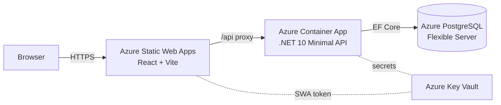

# Dostar

[](https://github.com/piers-sinclair/Dostar/actions/workflows/ci.yml)
[](https://codespaces.new/piers-sinclair/Dostar)

A production-ready fullstack starter — .NET 10 modular monolith backend + React/Vite frontend. Skip weeks of boilerplate and ship a deployable scaffold from day one.

## Architecture



## Stack

| Layer | Technology |
|-------|-----------|
| Backend | .NET 10 Minimal APIs, modular monolith |
| Frontend | React 19 + Vite + TypeScript |
| Database | PostgreSQL via EF Core (Azure Flexible Server in prod) |
| IaC | Bicep |
| Compute | Azure Container App (backend) + Azure Static Web Apps (frontend) |
| Package manager | **pnpm** — never npm or yarn |
| Tests | xUnit + Shouldly + NSubstitute / Testcontainers / Playwright |

## Quick start

The fastest path is the devcontainer — it installs all tooling, starts the database, and has one-click launch built in.

**First time (after clone):**

1. Open the repo in VS Code and choose **Reopen in Container** when prompted (or `Ctrl+Shift+P` → `Dev Containers: Reopen in Container`). The devcontainer starts PostgreSQL automatically.
2. Apply migrations: `Ctrl+Shift+P` → **Tasks: Run Task** → **`run: migrate`**
3. Press **F5** → select **`Dostar (API + Frontend)`** → both services start.

**Every subsequent session:**

Just press **F5** — no other steps needed.

| Service | URL |
|---------|-----|
| Frontend | http://localhost:5173 |
| Backend health | http://localhost:5000/healthz/live |
| API docs (Scalar) | http://localhost:5000/scalar/v1 |

> Run **`run: migrate`** again any time you pull commits that contain new EF Core migrations.

## VS Code tasks

All tasks are available via `Ctrl+Shift+P` → **Tasks: Run Task**.

| Task | What it does |
|------|-------------|
| `run: migrate` | Applies pending EF Core migrations against the local PostgreSQL database. Run once after clone, then again whenever new migrations are pulled. |
| `run: backend` | Starts the .NET API on `http://localhost:5000` without a debugger attached. Use when you want to run the backend independently (e.g. while working on the frontend). |
| `run: frontend` | Starts the Vite dev server on `http://localhost:5173` with hot-module replacement. |
| `run: dev` | Starts both `run: backend` and `run: frontend` in parallel — the terminal equivalent of F5 without a debugger. |
| `build: solution` | Builds the entire .NET solution. This is the default build task (`Ctrl+Shift+B`). |
| `build: Dostar.Api` | Builds only `Dostar.Api` — used internally as the pre-launch step for F5. |

## F5 launch configurations

Configurations are in `.vscode/launch.json` and selected from the **Run and Debug** panel (`Ctrl+Shift+D`).

| Configuration | What it does |
|---------------|-------------|
| `Dostar.Api (http)` | Builds and launches the backend with the .NET debugger attached. Opens Scalar (`/scalar/v1`) in the browser once the API is ready. Use this when you only need to debug the backend. |
| `Dostar (API + Frontend)` | Starts the Vite frontend first, then launches the backend with the debugger. **This is the recommended default for full-stack work.** Select it once in the Run panel; it becomes the target for every subsequent F5 press. |

To make `Dostar (API + Frontend)` your persistent F5 target: open the Run and Debug panel (`Ctrl+Shift+D`), click the dropdown at the top, and select **`Dostar (API + Frontend)`**.

## Project structure

```
backend/                ← .NET projects (not src/ — deployment boundary is explicit)
  Dostar.Api/           ← host/entry-point only; no business logic
  Dostar.SharedKernel/  ← IModule interfaces, shared types
  Modules/
    Todos/              ← example feature module
      Dostar.Todos.Contracts/
      Dostar.Todos.Implementation/
      Dostar.Todos.UnitTests/
      Dostar.Todos.IntegrationTests/
frontend/               ← React + Vite; standalone toolchain
tests/                  ← cross-cutting UI tests (Playwright)
infra/                  ← Bicep templates
.claude/commands/       ← Claude Code skills (slash commands)
docs/                   ← guides and ADRs
```

## Module pattern

Each business feature lives in four colocated projects: `Contracts`, `Implementation`, `UnitTests`, `IntegrationTests`. Consuming modules reference only `.Contracts` — never `.Implementation`. This lets you extract any module into a microservice without restructuring.

See [docs/module-pattern.md](docs/module-pattern.md) for the full guide.

## Claude Code skills

| Skill | Purpose |
|-------|---------|
| `/scaffold-module` | Scaffold a full feature module (all 4 projects) |
| `/add-migration` | Add an EF Core migration for a module |
| `/add-package` | Add a NuGet or npm package (with licence validation) |
| `/code-quality` | Audit code quality (SOLID, DRY, naming, async) |
| `/audit-azure-costs` | Audit Azure infra + CI/CD for cost savings |
| `/integration-tests` | Add integration tests for a module endpoint |
| `/playwright` | Write a Playwright UI test for a user journey |

See [docs/agents.md](docs/agents.md) for full documentation.

## Testing

```bash
# Unit tests (per module)
dotnet test backend/Modules/<Module>/Dostar.<Module>.UnitTests

# Integration tests (per module — requires Docker)
dotnet test backend/Modules/<Module>/Dostar.<Module>.IntegrationTests

# UI tests (Playwright)
cd tests && pnpm exec playwright test
```

## Deploy

See [docs/deploy-setup.md](docs/deploy-setup.md) for full deployment instructions.

Dostar deploys to:
- **Backend** — Azure Container App (auto-scaled, VNet-integrated)
- **Frontend** — Azure Static Web Apps (global CDN)
- **Database** — Azure PostgreSQL Flexible Server (private VNet)

CI/CD is managed by GitHub Actions workflows in `.github/workflows/`.

## CLI tool

The `dostar` CLI scaffolds new projects and modules:

```bash
npm install -g dostar            # or: dotnet tool install -g Dostar.Cli
dostar new-project my-app        # clone + rename template
dostar add-module Products       # scaffold a new feature module
dostar remove-module Products    # remove a module (with dry-run flag)
```

Source: [piers-sinclair/Dostar.Cli](https://github.com/piers-sinclair/Dostar.Cli)

## Contributing

See [CONTRIBUTING.md](CONTRIBUTING.md).

## License

MIT
