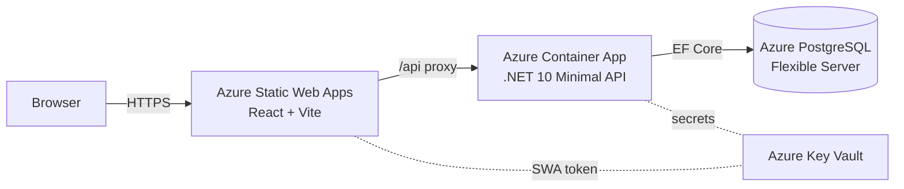

# Dostar

[](https://github.com/piers-sinclair/Dostar/actions/workflows/ci.yml)
[](https://codespaces.new/piers-sinclair/Dostar)

A production-ready fullstack starter — .NET 10 modular monolith backend + React/Vite frontend. Skip weeks of boilerplate and ship a deployable scaffold from day one.

## Architecture



## Stack

| Layer | Technology |
|-------|-----------|
| Backend | .NET 10 Minimal APIs, modular monolith |
| Frontend | React 19 + Vite + TypeScript |
| Database | PostgreSQL via EF Core (Azure Flexible Server in prod) |
| IaC | Bicep |
| Compute | Azure Container App (backend) + Azure Static Web Apps (frontend) |
| Package manager | **pnpm** — never npm or yarn |
| Tests | xUnit + Shouldly + NSubstitute / Testcontainers / Playwright |

## Prerequisites

| Tool | Version |
|------|---------|
| .NET SDK | 10 (`global.json` pins exact version) |
| Node.js | 20+ |
| pnpm | 10+ (`npm install -g pnpm`) |
| Docker Desktop | Latest |

## Quick start

```sh
# 1. Clone
git clone https://github.com/piers-sinclair/Dostar.git
cd Dostar

# 2. Start the database
docker compose up -d

# 3. Apply migrations (first time, and after pulling new migrations)
dotnet tool install --global dotnet-ef
bash tools/run-migrations.sh

# 4. Start the backend
dotnet run --project backend/Dostar.Api --launch-profile http

# 5. Start the frontend (new terminal)
cd frontend
pnpm install
pnpm dev
```

| Service | URL |
|---------|-----|
| Frontend | http://localhost:5173 |
| Backend health | http://localhost:5000/healthz/live |
| API docs (Scalar) | http://localhost:5000/scalar/v1 |

## Project structure

```
backend/                ← .NET projects (not src/ — deployment boundary is explicit)
  Dostar.Api/           ← host/entry-point only; no business logic
  Dostar.SharedKernel/  ← IModule interfaces, shared types
  Modules/
    Todos/              ← example feature module
      Dostar.Todos.Contracts/
      Dostar.Todos.Implementation/
      Dostar.Todos.UnitTests/
      Dostar.Todos.IntegrationTests/
frontend/               ← React + Vite; standalone toolchain
tests/                  ← cross-cutting UI tests (Playwright)
infra/                  ← Bicep templates
.claude/commands/       ← Claude Code skills (slash commands)
docs/                   ← guides and ADRs
```

## Module pattern

Each business feature lives in four colocated projects: `Contracts`, `Implementation`, `UnitTests`, `IntegrationTests`. Consuming modules reference only `.Contracts` — never `.Implementation`. This lets you extract any module into a microservice without restructuring.

See [docs/module-pattern.md](docs/module-pattern.md) for the full guide.

## Claude Code skills

| Skill | Purpose |
|-------|---------|
| `/scaffold-module` | Scaffold a full feature module (all 4 projects) |
| `/add-migration` | Add an EF Core migration for a module |
| `/add-package` | Add a NuGet or npm package (with licence validation) |
| `/code-quality` | Audit code quality (SOLID, DRY, naming, async) |
| `/audit-azure-costs` | Audit Azure infra + CI/CD for cost savings |
| `/integration-tests` | Add integration tests for a module endpoint |
| `/playwright` | Write a Playwright UI test for a user journey |

See [docs/agents.md](docs/agents.md) for full documentation.

## Testing

```bash
# Unit tests (per module)
dotnet test backend/Modules/<Module>/Dostar.<Module>.UnitTests

# Integration tests (per module — requires Docker)
dotnet test backend/Modules/<Module>/Dostar.<Module>.IntegrationTests

# UI tests (Playwright)
cd tests && pnpm exec playwright test
```

## Deploy

See [docs/deploy-setup.md](docs/deploy-setup.md) for full deployment instructions.

Dostar deploys to:
- **Backend** — Azure Container App (auto-scaled, VNet-integrated)
- **Frontend** — Azure Static Web Apps (global CDN)
- **Database** — Azure PostgreSQL Flexible Server (private VNet)

CI/CD is managed by GitHub Actions workflows in `.github/workflows/`.

## CLI tool

The `dostar` CLI scaffolds new projects and modules:

```bash
npm install -g dostar            # or: dotnet tool install -g Dostar.Cli
dostar new-project my-app        # clone + rename template
dostar add-module Products       # scaffold a new feature module
dostar remove-module Products    # remove a module (with dry-run flag)
```

Source: [piers-sinclair/Dostar.Cli](https://github.com/piers-sinclair/Dostar.Cli)

## Contributing

See [CONTRIBUTING.md](CONTRIBUTING.md).

## License

MIT
