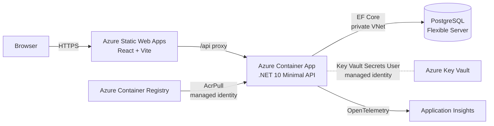
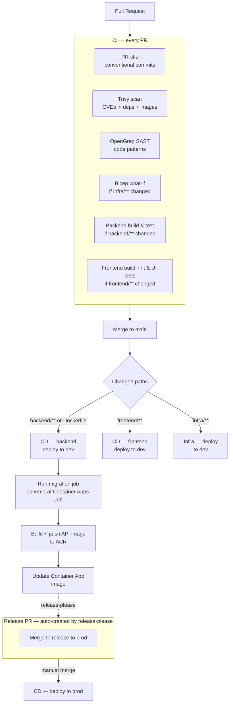
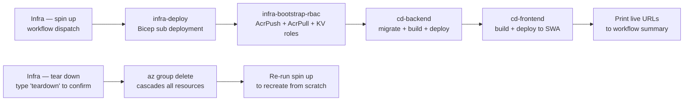

# Architecture

## High-level overview



The browser talks only to Static Web Apps. SWA proxies `/api` requests to the Container App — the API is never exposed to the browser directly. The API reads secrets from Key Vault at runtime via managed identity (no credentials in config), and all PostgreSQL traffic stays inside the VNet.

---

## Azure infrastructure topology

```mermaid
graph TB
    subgraph GitHub
        GHA[GitHub Actions\nOIDC SP]
    end

    subgraph Azure Subscription
        subgraph RG[Resource Group]
            subgraph VNet[Virtual Network 10.0.0.0/16]
                subgraph SubnetCA[snet-containerapp 10.0.0.0/23]
                    NSG1[NSG]
                    subgraph CAE[Container Apps Environment]
                        CA[Container App\n.NET 10 API]
                        MJ[Migration Job\nephemeral]
                    end
                end
                subgraph SubnetPG[snet-postgres 10.0.2.0/24]
                    NSG2[NSG]
                    PG[(PostgreSQL\nFlexible Server)]
                    DNS[Private DNS Zone\nserver.private.postgres\n.database.azure.com]
                end
            end

            ACR[Azure Container Registry\nAcrPush: CI SP\nAcrPull: CA managed identity]
            KV[Azure Key Vault\nSecrets User: CA managed identity\nSecrets User: CI SP]
            SWA[Azure Static Web Apps\nReact + Vite]
            LAW[Log Analytics Workspace]
            APPI[Application Insights]

            subgraph Alerting[Alerting — prod only]
                AR1[Alert: error rate > 10%]
                AR2[Alert: P99 latency > 2s]
                AR3[Alert: DB connectivity]
                AR4[Alert: container restarts]
                AG[Action Group\nemail]
            end
        end
    end

    Browser -->|HTTPS| SWA
    SWA -->|/api proxy| CA
    GHA -->|OIDC federated credential| Azure Subscription
    GHA -->|AcrPush| ACR
    ACR -->|AcrPull managed identity| CA
    ACR -->|AcrPull token TTL 1h| MJ
    CA -->|EF Core private VNet| PG
    MJ -->|EF Core migrations private VNet| PG
    DNS -.- PG
    CA -->|Key Vault Secrets User\nmanaged identity| KV
    CAE -->|diagnostic settings| LAW
    LAW --> APPI
    CA -->|OpenTelemetry| APPI
    APPI --> AR1 & AR2 & AR3 & AR4
    AR1 & AR2 & AR3 & AR4 --> AG
```

Resources marked "prod only" are conditionally deployed by Bicep. See [infrastructure.md](infrastructure.md) for Bicep module details, naming conventions, and scaling configuration.

---

## Key security decisions

| Decision | Implementation |
|---|---|
| No long-lived Azure credentials | GitHub Actions authenticates via OIDC federated credentials; no client secrets |
| No secrets in config or env vars | All secrets in Key Vault; app pulls at runtime via managed identity |
| PostgreSQL not publicly accessible | VNet-integrated via delegated subnet; private DNS zone; no public endpoint |
| Image supply chain | CI SP has AcrPush; Container App has AcrPull via managed identity; migration job uses a 1-hour TTL ACR token |
| Infra changes reviewed before merge | `infra/**` path trigger on PRs runs Bicep what-if and posts the diff as a PR comment |

---

## CI/CD pipeline



Prod deploys require a manual PR merge. To deploy to prod without waiting for a release PR, go to **Actions → CD — release to prod → Run workflow**.

---

## Spin up / tear down



Spin up sequences four reusable workflows. Tear down deletes the resource group; every resource inside it (Container App, PostgreSQL, Key Vault, Application Insights) is removed automatically. GitHub secrets and the repo are unaffected.

See [environment-lifecycle.md](environment-lifecycle.md) for step-by-step instructions and cost estimates.
