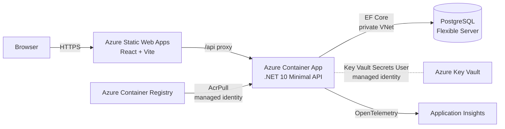
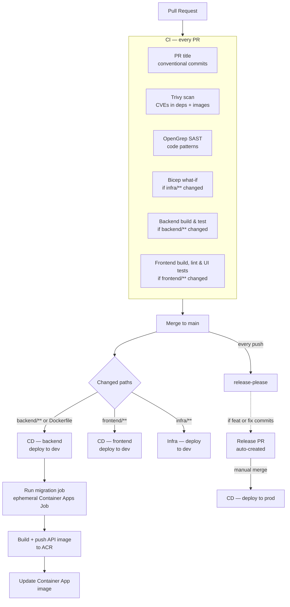
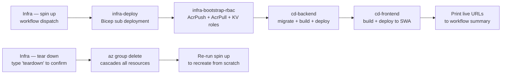

# Architecture

## High-level overview

The browser talks only to Static Web Apps. SWA proxies `/api` requests to the Container App — the API is never exposed to the browser directly. The API pulls secrets from Key Vault at runtime via managed identity (no credentials in config). All PostgreSQL traffic stays inside the VNet. GitHub Actions authenticates to Azure via OIDC — no long-lived credentials.

---

## Key security decisions

| Decision | Implementation |
|---|---|
| No long-lived Azure credentials | GitHub Actions authenticates via OIDC federated credentials; no client secrets |
| No secrets in config or env vars | All secrets in Key Vault; app pulls at runtime via managed identity |
| PostgreSQL not publicly accessible | VNet-integrated via delegated subnet; private DNS zone; no public endpoint |
| Image supply chain | CI SP has AcrPush; Container App has AcrPull via managed identity; migration job uses a 1-hour TTL ACR token |
| Infra changes reviewed before merge | `infra/**` path trigger on PRs runs Bicep what-if and posts the diff as a PR comment |

---

## CI/CD pipeline

Release-please runs on every push to `main` regardless of which paths changed. It opens or updates a Release PR when `feat:` or `fix:` commits have accumulated since the last release. Prod deploys require manually merging that Release PR. To deploy to prod on demand, go to **Actions → CD — release to prod → Run workflow**.

---

## Spin up / tear down

Spin up sequences four reusable workflows in order. Tear down deletes the resource group; every resource inside it (Container App, PostgreSQL, Key Vault, Application Insights) is removed automatically. GitHub secrets and the repo are unaffected.

See [environment-lifecycle.md](environment-lifecycle.md) for step-by-step instructions and cost estimates.
